<a href="#">
  <picture>
    <source media="(prefers-color-scheme: dark)" srcset="./header-dark.svg">
    <source media="(prefers-color-scheme: light)" srcset="./header.svg" />
    
  </picture>
</a>

<header>
  

    
    
    
  

</header>

Stats

<!--  -->

 

 

About

- 🌱 I’m currently learning Web Development, Cloud Computing 
- 🤠I’m looking for help with HTML, CSS, JavaScript, Java, Cloud Computing  
- 👨‍💻 All of my projects are available on my repository  
- 📫 How to reach me albimudakar04@gmail.com  
- ⚡ Fun facts like sharing experiences and knowledge programming. 

